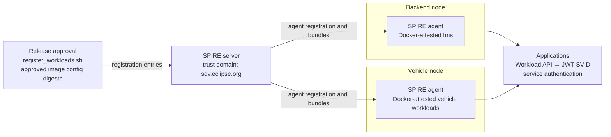

<!--
SPDX-FileCopyrightText: Copyright (c) 2026 Contributors to the Eclipse Foundation

See the NOTICE file(s) distributed with this work for additional
information regarding copyright ownership.

This program and the accompanying materials are made available under the
terms of the Apache License 2.0 which is available at
https://www.apache.org/licenses/LICENSE-2.0

SPDX-License-Identifier: Apache-2.0
-->
<!-- this readme was created with AI assistance -->
# SPIRE workload attestation

This directory contains the SPIRE configuration used by the commercial SDV
blueprint. SPIRE provides workload identity to the services that need to
authenticate to one another:

- `fms` runs in the backend and calls the vehicle's powertrain mode controller.
- `vehicle-properties` runs in the vehicle and authenticates to the KUKSA
  databroker.
- `powertrain-mode-controller` runs in the vehicle and authenticates requests
  to the diagnostic adapter.

The blueprint uses SPIRE's Docker workload attestor. A workload receives an
identity only when the image config digest of its running container matches a
SPIRE registration created for the agent on that host.

## Architecture

The following diagram intentionally shows only the main trust boundaries. The
details of the Docker socket and Workload API are described below it.



The server and agents use the `sdv.eclipse.org` trust domain. The server
authenticates the agents with the `x509pop` node attestor. The agent path is
derived from the certificate common name, producing the parent IDs used by
the registration script:

```text
spiffe://sdv.eclipse.org/spire/agent/x509pop/spire-agent-backend
spiffe://sdv.eclipse.org/spire/agent/x509pop/spire-agent-vehicle
```

The agents expose the SPIFFE Workload API through Unix sockets. The workload
containers receive those sockets through Docker volumes and use
`SPIFFE_ENDPOINT_SOCKET` to find them. Applications obtain JWT-SVIDs from the
API and pass them to other services; receiving services validate the token and
apply their own authorization policy. SPIRE identity establishes *who* the
workload is, while files such as `authorization-data.json` determine *what*
that identity may do.

## Blueprint registration behavior

The top-level [README](../../README.md) documents how to start the Compose
profiles and run `scripts/register_workloads.sh`. The script resolves each
local image's **config digest** (the value used by the Docker attestor), writes
`approved-workloads.yaml`, and registers the digest under the appropriate
backend or vehicle agent. It also warns when a running container has a
different digest. The list is generated data; the script's `WORKLOADS` array is
the inventory to change when services are added or renamed.

At runtime:

```text
container starts
  -> local SPIRE agent reads the container image config digest
  -> digest matches a registration below that agent
  -> agent issues an SVID through the Workload API
  -> application obtains and uses a JWT-SVID
```

If the digest does not match, or the workload is attached to the wrong agent,
the agent does not issue an identity and the application cannot obtain its
token.

## Blueprint caveats

This setup is intentionally small and local. Important production differences
and design considerations include:

- Example certificates and directly mounted private keys stand in for platform
  identity, rotation, and protected key storage.
- One SPIRE server, SQLite, and an in-memory key manager stand in for a highly
  available, durable, monitored, and audited control plane.
- The host script uses a private admin socket and replaces all entries; a
  production registration service would need scoped, authenticated, auditable
  lifecycle management.
- Read-only access to `/var/run/docker.sock` is still highly privileged; the
  appropriate runtime attestor and node-agent model depend on the platform.
- Local images and `:latest` tags stand in for immutable, signed release
  artifacts with verified provenance and supply-chain policy.
- One shared trust domain covers backend and vehicle workloads here; production
  boundaries may require per-vehicle scope, separate domains, federation, and
  distinct agent identities. SPIFFE identity remains separate from application
  authorization.
