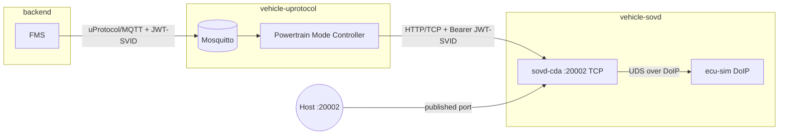
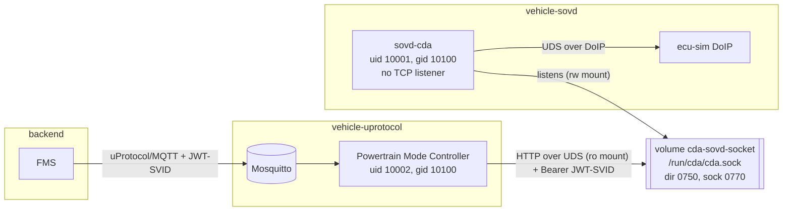
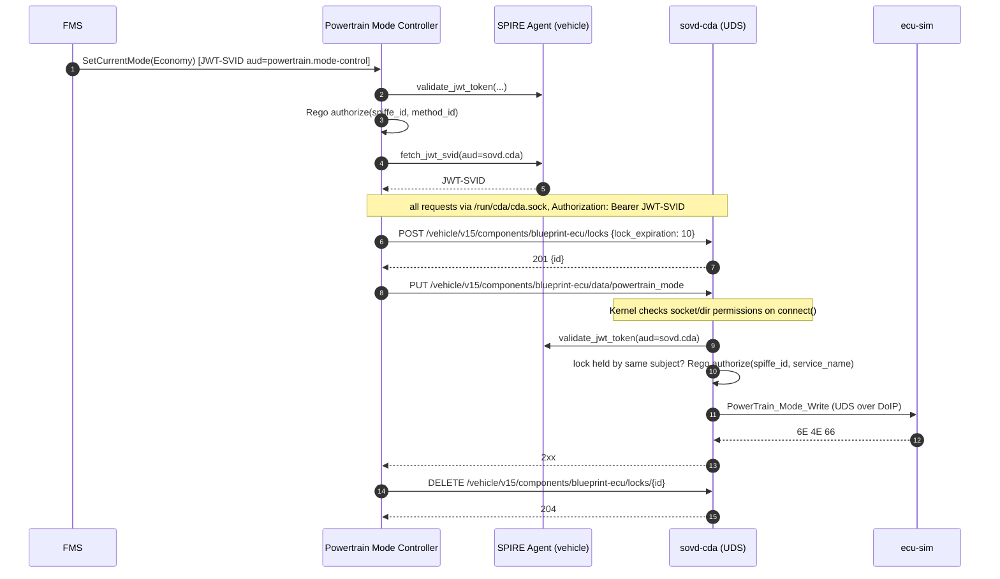

# Design: Expose the CDA SOVD API via a Protected Unix Domain Socket
| | |
|---|---|
| **Status** | Implemented on branch `feature/issue7-cda-unix-socket-pmc-client` (commits `3278eba`, `d39f31c`) |
| **Date** | 2026-10-06 |
| **Scope** | `sovd-cda`, `powertrain-mode-controller` (PMC), `docker-compose.yaml`, README |
| **Use case** | Set Powertrain Mode (`powertrain` profile) |
| This document is AI generated

---

## 1. Summary

The Classic Diagnostic Adapter (CDA) currently exposes its SOVD HTTP API on TCP port `20002`, both on the
`vehicle-sovd` Docker network and published to the host. The only in-vehicle client is the Powertrain Mode
Controller (PMC), which runs on the same host.

This design moves CDA off its TCP listener and serves the SOVD API exclusively over a Unix domain socket (UDS)
that is shared, with restricted permissions, only with the PMC. The existing SPIFFE JWT-SVID authentication and
OPA/Rego authorization in CDA are retained unchanged, so the result is defense in depth: kernel-enforced
transport access control **plus** workload-identity-based application authorization.

The document also defines when mutual TLS (mTLS) would be the appropriate mechanism instead.

---

## 2. Goals and Non-Goals

### Goals

1. CDA no longer listens on any TCP port for local (same-host) SOVD clients.
2. CDA's SOVD API is reachable only via a Unix socket whose access is restricted by filesystem permissions and
   container volume scoping.
3. PMC's HTTP client talks to CDA over that Unix socket.
4. JWT-SVID validation (audience `sovd.cda`) and Rego-based authorization in CDA keep working without change.
5. Document when mTLS is the better choice.

### Non-Goals

- Changing the DoIP path between CDA and `ecu-sim` (CDA stays on `vehicle-sovd` for UDS-over-DoIP).
- Changing uProtocol / MQTT security between FMS and PMC.
- Implementing mTLS.
- Changing SPIRE server/agent topology or registration selectors.

---

## 3. Current State

### 3.1 Architecture



### 3.2 Relevant facts

| Item | Current state | Source |
|---|---|---|
| CDA listener | TCP `0.0.0.0:20002`, published as `${CDA_PORT:-20002}:20002` | [docker-compose.yaml](../../../docker-compose.yaml) |
| CDA version | Git rev `99c60782…` of `classic-diagnostic-adapter` (TCP only) | [uservices/cda/Cargo.toml](../../../uservices/cda/Cargo.toml) |
| PMC networks | `vehicle-uprotocol` **and** `vehicle-sovd` | [docker-compose.yaml](../../../docker-compose.yaml) |
| PMC HTTP client | `reqwest 0.13`, built once via `reqwest::Client::builder().build()` | [uservices/powertrain/src/main.rs](../../../uservices/powertrain/src/main.rs) |
| PMC target URL | `SOVD_SERVER_BASE_URI=http://sovd-cda:20002/vehicle/v15/` + resource path | [uservices/powertrain/src/cli.rs](../../../uservices/powertrain/src/cli.rs) |
| CDA authN | Bearer JWT-SVID validated via SPIFFE Workload API, audience `sovd.cda` | [uservices/cda/src/spiffe_security_plugin.rs](../../../uservices/cda/src/spiffe_security_plugin.rs) |
| CDA authZ | Rego: `input.service_name in data.allowed_services[input.spiffe_id]` | [config/cda/config/authz.rego](../../../config/cda/config/authz.rego) |
| Container users | CDA (`debian:trixie-slim`) and PMC (`scratch`) both run as root | Dockerfiles |

### 3.3 Problems

- **Plaintext bearer tokens on a shared network.** JWT-SVIDs travel unencrypted over the `vehicle-sovd` bridge,
  which `ecu-sim` also joins. Any workload on that network can sniff and replay a token within its lifetime.
- **Unnecessary exposure.** The SOVD API is published to the host and reachable by every container on
  `vehicle-sovd`, although only the PMC needs it.
- **Network reachability is the only transport-level gate.** There is no kernel-enforced restriction on *which
  process* may connect.

---

## 4. Proposed Design

### 4.1 Target architecture



Key properties:

- CDA binds **only** to `/run/cda/cda.sock` (CDA's `--unix-socket` takes priority over and replaces the TCP
  listener).
- The socket lives in a dedicated named volume mounted **only** into `sovd-cda` (read-write) and
  `powertrain-mode-controller` (read-only).
- The PMC is removed from the `vehicle-sovd` network entirely.
- JWT-SVID + Rego authorization are unchanged.

### 4.2 Sequence



---

## 5. Detailed Design

### 5.1 Upgrade CDA dependency (prerequisite)

Unix socket support was added to CDA **after** the currently pinned revision:

| Commit | Description |
|---|---|
| `cef8be5` | feat(server): support binding the SOVD webserver to a Unix domain socket |
| `d8f25f6` | docs: document Unix domain socket support |
| `666b383` | fix(server): address PR review comments on unix-socket support |
| `38dc345` | refactor(server): replace flat server config with a `ServerTransport` enum |

These commits are currently present on the hackathon fork
(`Eclipse-SDV-Hackathon-Chapter-Four/classic-diagnostic-adapter`, branches `main` and `hackathon`).

Changes:

1. [uservices/cda/Cargo.toml](../../../uservices/cda/Cargo.toml): bump `rev` of all four CDA crates
   (`cda-database`, `cda-interfaces`, `cda-plugin-security`, `opensovd-cda`) to a commit that contains `38dc345`.
   If the commits are not yet upstream, switch the `git` URL to the fork.
2. [docker-compose.yaml](../../../docker-compose.yaml): update the `SOURCE_GIT_SHA` build arg to the same SHA.
3. Compile-verify the wrapper. `run_with_ext::<SP, SL, UPB, CPB>` still takes four generics, matching the existing
   call in [uservices/cda/src/main.rs](../../../uservices/cda/src/main.rs), but 37 commits separate the two revisions.
   Check:
   - `cda-plugin-security` trait signatures (`SecurityPluginInitializer`, `SecurityApi`, `AuthApi`, …).
   - `Setup` / `update_plugin_fn` / `create_default_update_plugin` APIs.
   - Toolchain: CDA uses edition 2024; confirm `RUST_VERSION=1.88` in the CDA Dockerfile is sufficient.

Outcome: the fork's `main` (`58f0c90`) was pinned. The wrapper compiled without changes and builds with
Rust 1.88. The revision also contains `deff30a` (lock preemption), which changed the write semantics – see §5.1a.

### 5.1a ECU lock before writes (consequence of the CDA upgrade)

Since `deff30a` ("feat: implement lock preemption"), CDA requires the caller to hold an active lock covering
the ECU for every SOVD data write; otherwise it answers `409 Conflict` (`LockRequired`, "Required lock is
missing"). The previously pinned revision had no such check. This is independent of the Unix socket.

Decision (live hackathon): adopt the new CDA behaviour instead of pinning to the commit before `deff30a`.
The PMC now, for every `SetCurrentMode` request:

1. `POST <base>/components/blueprint-ecu/locks` with `{"lock_expiration": 10}` → `201 {"id": …}`.
2. `PUT <base>/components/blueprint-ecu/data/powertrain_mode` (unchanged).
3. `DELETE <base>/components/blueprint-ecu/locks/{id}` → `204`, also when the write failed.

Notes:

- CDA matches locks to the JWT subject (`claims.sub()`); no lock id is sent with the write. The same JWT-SVID is
  used for all three requests.
- The 10 s expiration is a safety net if the release fails or the PMC crashes between steps.
- Reads (`GET …/powertrain_mode`) do not require a lock.
- The lock path is configurable via `SOVD_POWERTRAIN_LOCK_RESOURCE_PATH`
  (default `components/blueprint-ecu/locks`).

### 5.2 CDA: bind to a Unix socket

CDA behavior at the target revision (from `cda-sovd/src/lib.rs`):

- On start, removes any stale file at the socket path, then `UnixListener::bind(path)`.
- Does **not** set socket file permissions explicitly; mode is derived from the process `umask`.

Compose changes for `sovd-cda`:

| Setting | Change |
|---|---|
| `ports` | **Remove** `"${CDA_PORT:-20002}:20002"` |
| `command` | `["-d", "/app/odx", "--unix-socket", "/run/cda/cda.sock"]` |
| `volumes` | Add named volume `cda-sovd-socket` → `/run/cda` (read-write) |
| `user` | `"10001:10100"` (non-root `cda` user, `sovd-clients` group) |
| `cap_drop` / `security_opt` | `ALL` / `no-new-privileges:true` |
| `networks` | Unchanged (`vehicle-sovd`, required for DoIP) |
| `healthcheck` | `test -S /run/cda/cda.sock` |

### 5.3 Socket protection model

Access is controlled by several independent layers:

| Layer | Mechanism | Prevents |
|---|---|---|
| 1. No TCP listener | `--unix-socket` replaces TCP bind | Network access from any container or the host |
| 2. Volume scoping | `cda-sovd-socket` mounted only into `sovd-cda` and PMC | Other containers cannot see the socket path |
| 3. Read-only mount in PMC | `read_only: true` | PMC unlinking/replacing the socket (connect still works, as with `docker.sock:ro`) |
| 4. Directory permissions | `/run/cda` owned `10001:10100`, mode `0750` | Traversal by any UID not in group `10100` |
| 5. Socket permissions | `umask 0007` in CDA entrypoint → socket `0770` | `connect()` by others |
| 6. Network removal | PMC removed from `vehicle-sovd` | PMC reaching CDA/ECU over IP even if TCP were re-enabled |
| 7. Least privilege | `cap_drop: [ALL]`, `no-new-privileges` on CDA and PMC | Root/`CAP_DAC_OVERRIDE` bypassing file permissions |
| 8. Application authN/Z | JWT-SVID (`aud=sovd.cda`) + Rego | Callers without a valid SVID / without permission for the service |
| 9. (Optional) Peer creds | `SO_PEERCRED` UID allow-list in CDA | Any process in the group but not the expected UID |

Implementation details:

- **CDA Dockerfile** ([uservices/cda/Dockerfile](../../../uservices/cda/Dockerfile)), runtime stage:
  - Create group `sovd-clients` (GID 10100) and user `cda` (UID 10001, primary group 10100).
  - `mkdir -p /run/cda && chown 10001:10100 /run/cda && chmod 0750 /run/cda`.
  - Docker copies ownership/mode from the image into an **empty** named volume on first mount.
- **CDA entrypoint** ([uservices/cda/entrypoint.sh](../../../uservices/cda/entrypoint.sh)): add `umask 0007`
  before launching the binary, and launch with `exec` so CDA receives signals directly. The script is
  `#!/bin/sh` – keep it POSIX. (`umask 0117` was considered first, but it would also strip the execute bit from
  any directory CDA creates; the execute bit has no meaning on a socket, so `0007` gives the same protection.)
- **Non-root CDA**: verify that the entrypoint's `ip -4 a show …` and DoIP (ephemeral TCP, UDP `13400`) work
  without root. All ports involved are > 1024.
- **Stale volumes**: existing installations must recreate the volume once (`docker compose down -v`) so that the
  new ownership is applied.

> **macOS / Docker Desktop note:** Unix sockets must live in a **named volume** (inside the Linux VM), not in a
> bind mount from the macOS host filesystem, which does not support socket files reliably.

### 5.4 PMC: HTTP client over the Unix socket

Code changes:

1. [uservices/powertrain/src/cli.rs](../../../uservices/powertrain/src/cli.rs): add an optional argument
   `--sovd-server-unix-socket` / env `SOVD_SERVER_UNIX_SOCKET` (`Option<PathBuf>`).
2. [uservices/powertrain/src/main.rs](../../../uservices/powertrain/src/main.rs), `CurrentModeController::new`:
   - If the socket path is set, build the client with `reqwest::Client::builder().unix_socket(path)`.
   - Otherwise keep today's TCP behavior (backwards compatible; useful for remote/dev setups).
   - Request building, `bearer_auth(svid.token())`, and response handling remain unchanged.
3. Extend the startup log line to show the socket path when used.

Configuration semantics:

- `SOVD_SERVER_BASE_URI` becomes `http://localhost/vehicle/v15/`. With UDS, the authority only populates the
  HTTP `Host` header; scheme and path are still used and `Url::join` with
  `SOVD_POWERTRAIN_MODE_RESOURCE_PATH` keeps working.
- Verify `reqwest 0.13` exposes `ClientBuilder::unix_socket` without additional feature flags on the
  `*-unknown-linux-musl` targets used by the PMC Dockerfile.

Compose changes for `powertrain-mode-controller`:

| Setting | Change |
|---|---|
| `networks` | **Remove** `vehicle-sovd`; keep `vehicle-uprotocol` |
| `environment` | `SOVD_SERVER_BASE_URI=http://localhost/vehicle/v15/`, add `SOVD_SERVER_UNIX_SOCKET=/run/cda/cda.sock` |
| `volumes` | Add `cda-sovd-socket` → `/run/cda`, `read_only: true` |
| `user` | `"10002:10100"` (numeric IDs work with a `scratch` image) |
| `cap_drop` / `security_opt` | `ALL` / `no-new-privileges:true` |
| `depends_on.sovd-cda` | `service_healthy` |

Top-level `volumes:` gets a new entry `cda-sovd-socket:`.

### 5.5 SPIRE / identity – no change

- PMC keeps fetching a JWT-SVID with audience `sovd.cda` per request (`fresh_svid()`), sent as
  `Authorization: Bearer`.
- CDA keeps validating via `WorkloadApiClient::validate_jwt_token("sovd.cda", …)` and authorizing via Rego with
  [authorization-data.json](../../../config/cda/config/authorization-data.json).
- Registrations in [scripts/register_workloads.sh](../../../scripts/register_workloads.sh) use
  `docker:image_id` and `docker:env` selectors, which are unaffected by user/network changes.
- To verify: the non-root PMC (UID 10002) and CDA (UID 10001) can still connect to the SPIRE agent's public
  Workload API socket in `spire-agent-vehicle-socket`.

### 5.6 Optional: peer credential check in CDA

As an additional layer, CDA could read `SO_PEERCRED` on each accepted UDS connection and accept only
configured UIDs (e.g. `10002`). This requires a change in CDA (`cda-sovd`) to expose connection info to
middleware and is **out of scope unless explicitly approved** (see §11).

### 5.7 Developer / debug access

With the host port removed, the README examples using `http://localhost:20002` no longer work. Options:

- **A. Ephemeral client container (recommended, no extra exposure):**

  ```sh
  docker run --rm --user 10003:10100 \
    -v commercial-sdv-stack_cda-sovd-socket:/run/cda:ro \
    curlimages/curl -s --unix-socket /run/cda/cda.sock \
    -H "Authorization: Bearer $TOKEN" \
    http://localhost/vehicle/v15/components/blueprint-ecu
  ```

  Note: a valid JWT-SVID is still required for protected resources.

- **B. Opt-in debug override** `docker-compose.debug.yaml` that re-enables TCP on `127.0.0.1` only, explicitly
  not for production.

---

## 6. Security Analysis

| Threat | Before | After |
|---|---|---|
| Token sniffing on `vehicle-sovd` (e.g. by `ecu-sim` or a compromised container) | Possible (plaintext HTTP) | Not possible – no network traffic for SOVD |
| Unauthorized container reaching SOVD API | Any container on `vehicle-sovd` | Only containers with the volume **and** group 10100 |
| Host process reaching SOVD API | Any via published port | Only root on the Docker host/VM |
| Token replay by a workload with socket access | Possible within token lifetime | Still possible – mitigated by short SVID TTL, Rego, optional `SO_PEERCRED` |
| PMC tampering with the socket | n/a | Prevented by read-only mount and directory ownership |
| Compromised PMC calling unauthorized diagnostic services | Blocked by Rego | Blocked by Rego (unchanged) |
| Root on host | Full access | Full access (out of scope; same for any local IPC) |
| Workload with socket access + valid SVID acquiring an ECU lock | n/a (no locks) | **Possible** – lock endpoints are not covered by Rego (found in test T6c) |

Residual risks:

- JWT-SVIDs are still bearer tokens. A UDS removes the network eavesdropping vector but does not
  cryptographically bind the token to the caller. See §7.
- CDA's lock endpoints only check authentication, not the Rego policy. Any workload that can reach the socket
  and holds a valid JWT-SVID for `sovd.cda` can acquire an (exclusive) ECU lock and block the PMC's writes.
  Follow-up: implement CDA's vendor lock validation hook (added in `deff30a`) in the SPIFFE security plugin and
  evaluate it against Rego.
- Anyone with access to the Docker API can start a container that mounts the socket volume with the right
  group; Docker API access must be treated as root-equivalent.

---

## 7. When mTLS Is Appropriate Instead

A Unix socket is the right choice when the **client and CDA share a kernel**: the OS enforces who can connect,
there is no network to eavesdrop, and the JWT-SVID provides workload identity for Rego authorization.

Use **mTLS with X.509-SVIDs** (from the existing SPIRE deployment) when any of the following apply:

| Situation | Why UDS is insufficient | Why mTLS helps |
|---|---|---|
| Client and CDA on **different hosts / VMs / ECUs** (e.g. separate HPC, zonal controller, hypervisor partitions, Kubernetes pods on different nodes) | Unix sockets cannot cross a host boundary | Authenticated, encrypted channel over the network |
| Traffic crosses an **untrusted or shared network** (in-vehicle Ethernet backbone, remote/backend diagnostics, workshop testers) | Plain TCP exposes bearer tokens | Confidentiality and integrity in transit |
| **Token replay must be impossible**, not just unlikely | JWT-SVID is a bearer token | Identity bound to a private key that never leaves the workload |
| **Regulatory / customer requirements** for encryption and mutual authentication in transit (e.g. ISO/SAE 21434, UNECE R155 CSMS evidence) | UDS gives no cryptographic proof | Standard, auditable mechanism |
| **Many clients / frequent rotation** across machines | Group/UID management does not scale across hosts | SPIRE rotates X.509-SVIDs automatically; authorize on SPIFFE ID |

mTLS and JWT-SVID are complementary: mTLS authenticates the **connection** (peer workload), while the JWT
carries **per-request** claims and audience that the Rego policy can evaluate. A future cross-host deployment
could combine both, or authorize directly on the mTLS peer SPIFFE ID.

---

## 8. Alternatives Considered

| Alternative | Reason not chosen |
|---|---|
| Keep TCP, bind CDA to `127.0.0.1` | Containers do not share a loopback; would require `network_mode: service:sovd-cda`, coupling PMC to CDA's lifecycle and network namespace |
| Keep TCP, remove host port only | Token still plaintext on `vehicle-sovd`; `ecu-sim` remains a co-tenant |
| Dedicated internal network just for PMC↔CDA | Better than today, but still IP-reachable, no kernel UID-level control, plaintext tokens |
| mTLS on the local link | Higher complexity (cert plumbing in CDA's axum server and PMC client) for no added benefit on the same host; see §7 for when it is warranted |
| Run CDA as a sidecar in PMC container | Breaks separation of concerns and independent lifecycle/update |

---

## 9. Rollout Plan

| Phase | Work | Exit criterion |
|---|---|---|
| 1 | Bump CDA rev, update `SOURCE_GIT_SHA`, fix compile issues | `sovd-cda` builds and runs on TCP as before |
| 2 | CDA Dockerfile (user/group, `/run/cda`), entrypoint `umask`/`exec`, compose: UDS command, volume, `user`, remove port | `/run/cda/cda.sock` exists, no TCP listener |
| 3 | PMC CLI/env + `reqwest` UDS client; compose: env, volume (ro), `user`, remove `vehicle-sovd` | End-to-end mode switching works |
| 4 | Verify JWT-SVID + Rego unchanged (positive and negative tests) | §10 tests pass |
| 5 | README: Service APIs, example requests, "Securing CDA access: UDS vs mTLS" section; volume-recreate note | Docs reviewed |

Rollback: revert compose changes. Because the PMC Unix-socket option is optional, the PMC can be pointed back to
TCP by unsetting `SOVD_SERVER_UNIX_SOCKET` and restoring `SOVD_SERVER_BASE_URI`.

---

## 10. Verification Plan

| # | Test | Expected result | Actual result |
|---|---|---|---|
| 1 | `docker compose exec sovd-cda ss -ltn` | No listener on `20002` (or any SOVD port) | ✅ only Docker DNS on `127.0.0.11` |
| 2 | `curl http://localhost:20002/...` from host | Connection refused | ✅ connection failed |
| 3 | `docker compose exec sovd-cda ls -ln /run/cda` | Dir `drwxr-x---` `10001 10100`; socket `srwxrwx---` `10001 10100` | ✅ as expected |
| 4 | Happy path (FMS → PMC → CDA → ecu-sim) | PMC log: `Powertrain mode set to: Economy/Performance`; ecu-sim log: `2E 4E 66 …` → `6E 4E 66` | ✅ alternating every 5 s, lock acquired/released per write |
| 5 | From PMC network (`vehicle-uprotocol`), connect to `sovd-cda:20002` | Name/route not resolvable | ✅ curl exit 6 (cannot resolve); from `vehicle-sovd`: exit 7 (refused) |
| 6 | Ephemeral container with volume but `--user 10003:10003` | `connect()` fails | ✅ could not connect |
| 7 | Ephemeral container with group 10100, no `Authorization` header | `401` | ✅ `401` |
| 8 | Valid JWT-SVID for a SPIFFE ID not in `authorization-data.json` | `403` / access denied | ✅ read `403`, write `409` (lock check precedes Rego) |
| 8a | Same identity acquires an ECU lock | Rejected | ⚠️ `201` – see residual risks in §6 |
| 9 | Restart `sovd-cda` | Stale socket removed, new socket created, PMC recovers on next request | ✅ recovered after recreate |
| 10 | PMC attempts `rm /run/cda/cda.sock` | Fails (read-only filesystem) | ✅ `Read-only file system` |
| 11 | Container without the volume | Socket not visible | ✅ `No such file or directory` |

---

## 11. Decisions

| # | Question | Decision |
|---|---|---|
| D1 | CDA source for UDS support | Pinned to hackathon fork `58f0c90`; move back to upstream once merged |
| D2 | Run CDA and PMC as non-root | Yes – plus `cap_drop: [ALL]` and `no-new-privileges` |
| D3 | `SO_PEERCRED` UID check in CDA | Out of scope; follow-up |
| D4 | Developer access | Ephemeral curl container only (README); no debug compose file |
| D5 | Concrete UID/GID values | CDA 10001, PMC 10002, group `sovd-clients` 10100 |
| D6 | 409 `LockRequired` from new CDA | PMC acquires/releases a short-lived ECU lock per write (§5.1a) |
| D7 | Rego for lock endpoints | Follow-up: implement CDA vendor lock validation hook in the SPIFFE plugin |

---

## 12. Files Affected

| File | Change |
|---|---|
| [uservices/cda/Cargo.toml](../../../uservices/cda/Cargo.toml) | CDA pinned to hackathon fork `58f0c90` |
| `uservices/Cargo.lock` | Updated CDA source |
| [uservices/cda/Dockerfile](../../../uservices/cda/Dockerfile) | Non-root user/group, `/run/cda` with ownership/mode |
| [uservices/cda/entrypoint.sh](../../../uservices/cda/entrypoint.sh) | `umask 0007`, `exec` |
| [uservices/powertrain/src/cli.rs](../../../uservices/powertrain/src/cli.rs) | New optional `SOVD_SERVER_UNIX_SOCKET` and `SOVD_POWERTRAIN_LOCK_RESOURCE_PATH` args |
| [uservices/powertrain/src/main.rs](../../../uservices/powertrain/src/main.rs) | `reqwest` client with `unix_socket` when configured; ECU lock around writes; log line |
| [docker-compose.yaml](../../../docker-compose.yaml) | New volume; `sovd-cda` and PMC changes; `SOURCE_GIT_SHA` |
| [README.md](../../../README.md) | Service APIs, example requests, "Securing Access to the CDA" section |

No changes: `spiffe_security_plugin.rs`, `config/cda/config/authz.rego`, `authorization-data.json`,
`scripts/register_workloads.sh`, SPIRE configuration, `ecu-sim`.
